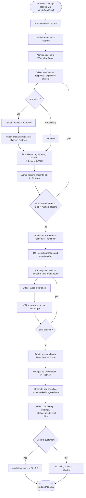

# Product Requirements Document (PRD) — PilotNow

AI-Enabled Workforce Operations Platform for Security Manpower Management

| Field | Value |
|-------|-------|
| **Product** | PilotNow |
| **Vendor** | NEXSTACK PTE. LTD. |
| **Client** | Kestrel Investigation & Security Pte. Ltd. |
| **Version** | 2.1 |
| **Status** | Draft — updated for review |
| **Author** | Aira Ling |
| **Reviewers** | Ken Ling |
| **Created** | 2026-02-23 |
| **Last Updated** | 2026-07-07 |

## Revision History

| Version | Date | Author | Changes |
|---------|------|--------|---------|
| 1.0 | 2026-02-23 | Aira Ling | Initial PRD |
| 2.0 | 2026-05-12 | Aira Ling | Rewritten as full baseline product requirement and end-to-end operational flow |
| 2.1 | 2026-07-07 | Aira Ling | Reframed PRD around the approved Kestrel operating flow: customer request → admin job creation → WhatsApp officer sourcing → onboarding/rate agreement → assignment → hourly proof → completion → officer payable computation → customer billing status. AI is positioned as an assisting worker, not the main operational stream. |

---

## 1. Overview

PilotNow is a workforce operations platform that digitises Kestrel's end-to-end security manpower cycle — from customer job intake, through officer sourcing, rate agreement, deployment, and hourly proof-of-service, to job completion, per-officer pay computation, and customer billing status.

Today these steps run through fragmented WhatsApp messages, calls, and manual record-keeping. PilotNow consolidates them into one system of record while retaining WhatsApp as the field-facing channel officers already use.

The approved operating model is **admin-led**. Admin users remain responsible for receiving customer requests, creating jobs, posting jobs to WhatsApp groups, onboarding officers, agreeing rates, assigning officers, monitoring proof, closing jobs, and updating payment/billing statuses.

AI agents, code pilots, automation helpers, and future intelligent workflows are treated as **supporting workers** inside the system. They may help parse messages, prepare drafts, remind officers, detect missing proof, or suggest next actions, but they do not replace the core admin-led operating stream unless explicitly approved by a later change request.

## 2. Goals and Non-Goals

### 2.1 Goals

| Goal | Requirement Direction |
|------|------------------------|
| Single source of truth | Store jobs, customers, sites, officers, assignments, rates, proof photos, completion status, payment status, and billing status in PilotNow. |
| Reduce manual coordination effort | Make job creation, officer sourcing, assignment, reminders, and follow-up easier for admin users. |
| Preserve WhatsApp field workflow | Keep officers working mainly through WhatsApp for job interest, acknowledgements, reminders, proof photos, and status responses. |
| Capture reliable proof-of-service | Collect hourly proof photos for every officer on active duty and link them to the correct job/officer. |
| Compute officer payables | Compute what Kestrel owes each officer per completed job using hours worked × agreed assignment rate. |
| Track officer payment status | Track Paid / Unpaid status per officer assignment after completion. |
| Track customer billing status | Track whether the completed job has been billed to the customer using BILLED / NOT BILLED status. |
| Support audit and dispute handling | Preserve timelines, proof photos, rates, assignment history, and admin actions. |

### 2.2 Non-Goals for Current Baseline

The following are out of scope for the current PRD unless approved later:

- Automated payroll disbursement, bank transfer, CPF, payslip generation, or full payroll processing.
- Automated invoice generation or accounting-system posting. Billing is a status flag in this baseline, not a full invoice engine.
- Margin calculation or margin display using customer bill minus officer payout.
- Full customer self-service portal.
- Fully autonomous AI-run operations. AI may assist, remind, draft, parse, suggest, or flag exceptions, but the main stream remains admin-led.

## 3. Users and Roles

| Role | Responsibilities | Needs |
|------|------------------|-------|
| **Admin / Operations** | Receives requests, creates jobs, posts jobs to WhatsApp group, onboards officers, agrees hourly rates, assigns officers, sends/monitors reminders, closes jobs, updates payment and billing statuses. | Fast job setup, clear staffing status, simple proof tracking, accurate payable/billing summaries. |
| **Security Officer** | Responds to job posts, submits IC if new, agrees hourly rate, acknowledges assignment, reports on duty, submits hourly proof photos via WhatsApp. | Clear job details, simple WhatsApp instructions, timely reminders, accurate rate/payment record. |
| **Management** | Reviews live jobs, completed jobs, proof status, officer payables, unpaid items, billed/unbilled jobs, and audit history. | Oversight, searchable records, exception visibility, finance readiness. |
| **Finance / Billing User** | Uses completed job summaries and billing status to support customer billing and officer payment follow-up. | Payable totals, Paid/Unpaid status, BILLED/NOT BILLED status, exportable summaries. |

## 4. Product Principles

1. **Admin-led operations first** — PilotNow must follow the real operating flow used by Kestrel.
2. **WhatsApp remains the field channel** — Officers should not need to learn a complex app for basic field tasks.
3. **One job can have many officers** — Staffing, rate agreement, proof, and payables must be tracked per officer assignment.
4. **Rates are assignment-specific** — Different officers on the same job may agree to different hourly rates.
5. **Proof must be linked and auditable** — Every proof photo should be traceable to job, officer, time, and reminder cycle.
6. **Completion is not the same as billing or payment** — Job completion, officer payment status, and customer billing status are separate states.
7. **AI is a worker, not the main stream** — Any AI agent, code pilot, or automation should support the workflow, not redefine ownership of the workflow.

## 5. Approved Core Workflow

This is the main product flow PilotNow must support.

### 5.1 Workflow Notes

- Customer request may arrive by WhatsApp or email.
- Admin creates the job in PilotNow; the system may assist by parsing pasted text, but admin owns confirmation.
- Admin posts the job to the WhatsApp group to source interested officers.
- New officers must be onboarded before assignment.
- Officer IC/onboarding records must be stored with appropriate access control and masking.
- Hourly rate is agreed per officer assignment.
- One job may require multiple officers; the sourcing/onboarding/rate/assignment loop repeats until required headcount is filled.
- Hourly proof reminders are required. These should be automated where possible, while still allowing admin manual follow-up.
- Completion triggers pay computation per officer.
- Customer BILLED / NOT BILLED status is separate from job completion.
- Officer Paid / Unpaid status is separate from customer billing status.

## 6. Job Status, Payment Status, and Billing Status Model

### 6.1 Job Execution Status

| Status | Meaning |
|--------|---------|
| **OPEN** | Job created; officer sourcing or staffing is in progress. |
| **ASSIGNED** | Required officers have been assigned and schedule/reminder has been sent. |
| **IN_PROGRESS** | Shift is active; officers are reporting on duty and proof is being collected. |
| **COMPLETED** | Shift has ended; required proof has been reviewed; officer payables can be computed. |
| **CANCELLED** | Job cancelled with reason and audit trail. |

### 6.2 Customer Billing Status

Customer billing status is tracked per completed job and is separate from job execution status.

| Status | Meaning |
|--------|---------|
| **NOT BILLED** | Completed job has not yet been marked as billed to customer. |
| **BILLED** | Admin has marked the completed job as billed to customer. |

### 6.3 Officer Payment Status

Officer payment status is tracked per officer assignment and is separate from customer billing status.

| Status | Meaning |
|--------|---------|
| **UNPAID** | Payable has been computed but not marked paid. |
| **PAID** | Authorized admin has marked the officer assignment as paid. |

## 7. Functional Requirements

## 7.1 Job Intake and Creation

### FR-001 Customer Request Capture
**Priority:** Must

PilotNow shall allow admin users to record customer job requests received via WhatsApp or email.

Minimum fields:
- customer / company
- site or deployment location
- date
- start time and end time
- headcount required
- job instructions
- request source
- request notes or pasted customer message

**Acceptance criteria**
- Given an admin receives a customer request, when they create a job, then the job is stored in PilotNow with required operational details.
- Given required fields are missing, when admin attempts to save, then the system highlights missing fields.
- Given a similar job already exists for the same site/time, when admin creates a new job, then the system warns of possible duplicate.

### FR-002 Assisted Request Parsing
**Priority:** Should

The system may assist admins by parsing pasted WhatsApp/email job text into structured job fields.

**Important boundary:** parsing support is an assistant function only. Admin must be able to review and confirm before the job becomes operational.

### FR-003 Multi-Officer Job Support
**Priority:** Must

PilotNow shall support jobs requiring one or more officers.

**Acceptance criteria**
- Given a job requires multiple officers, when admin assigns officers, then the system tracks each officer as a separate assignment under the same job.
- Given required headcount is not yet filled, when admin views the job, then the system shows remaining headcount.

## 7.2 Officer Sourcing and Onboarding

### FR-004 WhatsApp Group Sourcing Record
**Priority:** Must

PilotNow shall support the operational step where admin posts a job to a WhatsApp officer group and records interested officer responses.

Minimum capabilities:
- mark job as posted to WhatsApp group
- record interested officers
- record response timestamp or admin note
- support manual entry when responses happen outside direct system capture

### FR-005 Officer Master Record
**Priority:** Must

PilotNow shall maintain officer records.

Minimum fields:
- officer name
- phone number
- active/inactive status
- IC/onboarding verification status
- masked IC/reference where appropriate
- notes
- assignment history
- payment status history

### FR-006 New Officer Onboarding Before Assignment
**Priority:** Must

If an interested officer is new, admin must onboard and record the officer in PilotNow before assignment.

Minimum capabilities:
- capture onboarding status
- record IC submitted / verified status or approved identity verification note
- restrict full assignment until required onboarding fields are completed, unless admin overrides with reason
- store sensitive data with access control and audit trail

**Acceptance criteria**
- Given an officer is not in the system, when admin tries to assign them, then the system requires officer creation/onboarding first.
- Given onboarding is incomplete, when admin overrides assignment, then the system records override reason and actor.

## 7.3 Rate Agreement and Assignment

### FR-007 Assignment-Level Hourly Rate
**Priority:** Must

PilotNow shall store the agreed hourly rate against each officer's assignment on a job.

This is required because different officers on the same job may agree to different hourly rates.

Minimum fields:
- offered rate
- accepted/agreed hourly rate
- currency
- agreement note
- actor who recorded the rate
- timestamp

**Acceptance criteria**
- Given Officer A and Officer B are assigned to the same job, when different rates are agreed, then the system stores each rate independently.
- Given an assignment has no agreed rate, when admin attempts to complete the job, then the system warns that payable computation is incomplete.

### FR-008 Officer Assignment
**Priority:** Must

Admin shall be able to assign one or more officers to a job after onboarding and rate agreement.

Minimum capabilities:
- assign officer
- remove/reassign officer
- show assigned headcount versus required headcount
- send job details and schedule reminder
- record assignment audit trail

### FR-009 Acknowledgement Tracking
**Priority:** Must

Officer acknowledgement shall be tracked after job details are sent.

Minimum statuses:
- pending acknowledgement
- acknowledged
- declined
- no response

### FR-010 Assignment Conflict Warning
**Priority:** Should

The system should warn admin if an officer appears to be assigned to overlapping jobs or marked unavailable.

## 7.4 Reminders and Field Execution

### FR-011 Job Details and Schedule Reminder
**Priority:** Must

Once all required officers are assigned, admin shall send job details and reminders to officers.

The system should support automated reminder scheduling while allowing manual admin follow-up.

Minimum reminder types:
- assignment message
- pre-shift reminder
- report-on-duty reminder
- hourly proof reminder

### FR-012 Report-on-Duty Tracking
**Priority:** Must

Officers shall report on duty at the start of the shift. Admin shall be able to see who has reported and who has not.

### FR-013 Hourly Proof Photo Reminder
**Priority:** Must

During an active shift, PilotNow shall support hourly reminders for each assigned officer to take and send proof photos via WhatsApp.

Minimum capabilities:
- configure reminder frequency, with hourly as baseline
- send reminders automatically where integration supports it
- allow admin to manually trigger reminder
- track expected proof windows
- flag missing proof

**Acceptance criteria**
- Given a shift is ongoing, when the hourly interval is reached, then the officer receives a proof reminder.
- Given an officer does not submit proof within the configured grace period, then the system flags missing proof for admin follow-up.

### FR-014 Proof Photo Capture
**Priority:** Must

Officer proof photos sent via WhatsApp shall be captured against the correct job and officer.

Minimum metadata:
- job ID
- officer ID
- assignment ID
- timestamp received
- media file/reference
- reminder cycle or proof window
- admin correction note if manually matched

### FR-015 Shift Ongoing Loop
**Priority:** Must

The system shall continue hourly proof reminder and capture cycles while the shift is ongoing, then stop after shift end or job completion.

### FR-016 Missing Proof Exception
**Priority:** Must

The system shall surface missing or late hourly proof to admin.

Minimum capabilities:
- highlight missing proof by officer and hour
- allow admin to mark resolved with note
- preserve unresolved missing proof in completed job summary

## 7.5 Completion, Payables, and Billing

### FR-017 Job Completion
**Priority:** Must

Admin shall be able to mark a job as COMPLETED after the shift has ended and proof has been reviewed.

The completion screen shall warn if:
- required officers have missing proof
- an assigned officer has no agreed hourly rate
- worked hours are missing or inconsistent
- an officer did not report on duty

### FR-018 Worked Hours Calculation
**Priority:** Must

PilotNow shall determine hours worked per officer assignment.

Baseline behaviour:
- default to scheduled job hours unless admin edits actual hours
- allow manual adjustment with reason
- preserve actual hours used for payable computation

### FR-019 Per-Officer Payable Computation
**Priority:** Must

PilotNow shall compute pay per officer using:

`payable = hours worked × agreed hourly rate`

Minimum capabilities:
- compute payable per officer assignment
- show total payable per officer
- show total officer payout for the completed job
- show missing data warnings where rate or hours are unavailable
- preserve manual override notes

### FR-020 Completed Job Summary
**Priority:** Must

Completed job view shall show:
- customer
- site
- job date/time
- assigned officers
- agreed rate per officer
- hours worked per officer
- payable per officer
- proof photo status by officer/hour
- total officer payout
- officer Paid / Unpaid status
- customer BILLED / NOT BILLED status

### FR-021 Officer Paid / Unpaid Status
**Priority:** Must

PilotNow shall track payment status per officer assignment.

Baseline statuses:
- UNPAID
- PAID

Minimum capabilities:
- default to UNPAID when payable is computed
- allow authorized admin to mark PAID
- record actor, timestamp, and optional payment reference/note
- allow reversal only with reason and audit trail
- filter completed jobs by unpaid officer payables

### FR-022 Customer Billing Status
**Priority:** Must

PilotNow shall track whether each completed job has been billed to the customer.

Baseline statuses:
- NOT BILLED
- BILLED

Minimum capabilities:
- default completed jobs to NOT BILLED
- allow authorized admin to mark BILLED
- record actor, timestamp, and optional billing reference/note
- filter completed jobs by billing status

**Important:** customer billing status is not the same as officer payment status.

### FR-023 Margin Exclusion
**Priority:** Must

The baseline shall not calculate or display margin using customer bill minus officer payout.

## 7.6 Dashboards and Screens

### FR-024 Job List / Dashboard
**Priority:** Must

The job list/dashboard shall show live and past jobs with clear operational status.

Minimum fields:
- job ID
- customer
- site
- date/time
- required headcount
- assigned headcount
- job status
- proof status indicator
- customer billing status
- unpaid officer payable indicator

### FR-025 Job Detail
**Priority:** Must

The job detail screen shall show full job information, assignment details, proof history, completion data, and billing/payment statuses.

### FR-026 Officer Master
**Priority:** Must

The officer master screen shall show officer profile, onboarding status, assignment history, rate history, and payment status history.

### FR-027 Completed Job Summary Screen
**Priority:** Must

The completed job summary screen shall be optimized for operational and finance review.

It shall show per-officer payable, total payout, proof completeness, Paid/Unpaid statuses, and customer BILLED/NOT BILLED status.

### FR-028 Search and Filters
**Priority:** Should

Admins shall be able to search and filter jobs by:
- customer
- site
- officer
- date range
- job status
- proof status
- customer billing status
- officer payment status

## 7.7 Audit, Security, and Compliance

### FR-029 Audit Trail
**Priority:** Must

The system shall log significant operational events, including:
- job creation/editing
- WhatsApp posting marker
- officer onboarding
- rate agreement
- assignment/reassignment
- reminder sent
- proof received
- completion
- payable computation
- payment status change
- billing status change

### FR-030 Sensitive Data Handling
**Priority:** Must

Officer IC and identity-related records shall be protected with appropriate access control, masking, retention rules, and audit logging.

### FR-031 Evidence Retention
**Priority:** Must

Proof photos and related metadata shall be retained according to configured retention policies and remain retrievable for dispute handling.

## 7.8 AI / Automation as Supporting Worker

### FR-032 AI Assistance Boundary
**Priority:** Must

Any AI agent, code pilot, automation assistant, or workflow bot in PilotNow shall be positioned as a supporting worker.

Allowed assistant behaviours:
- parse pasted customer requests into draft job fields
- draft WhatsApp messages for admin review
- schedule or send configured reminders
- identify missing proof
- suggest officer candidates based on available records
- summarize completed job evidence
- flag incomplete payable/billing data

Not allowed in baseline without explicit admin confirmation:
- create final operational jobs without admin confirmation
- onboard officers without admin review
- approve rates outside configured rules
- mark jobs completed without admin action
- mark officer payments as PAID without authorized admin action
- mark customer jobs as BILLED without authorized admin action
- replace the approved admin-led operating flow

## 8. Non-Functional Requirements

### 8.1 Usability

- Admin workflows must be fast enough for daily operations.
- Officer-facing interactions should remain simple and WhatsApp-first.
- Completed job summaries must be readable by operations, management, and finance users.

### 8.2 Reliability

- Reminder delivery failures must be visible to admin.
- Proof photos must not be silently dropped.
- Completion warnings must prevent accidental incomplete closure where possible.

### 8.3 Performance

- Job list and job detail screens should load within acceptable operational latency for daily usage.
- WhatsApp reminder/proof handling should feel near real-time where provider limits allow.

### 8.4 Security and Compliance

- HTTPS for web surfaces.
- Role-based access control for admin, management, and finance views.
- Restricted access to officer IC/onboarding records.
- Audit logging for sensitive data access and status changes.
- PDPA-aware handling of phone numbers, IC records, photos, and operational evidence.

### 8.5 Scalability

The baseline should support growth in:
- number of jobs per day
- number of officers per job
- number of proof photos per shift
- number of completed job records and audit events

## 9. Integrations

| Integration | Purpose | Baseline Direction |
|-------------|---------|--------------------|
| WhatsApp provider / GreenAPI | Officer sourcing, reminders, acknowledgement, proof photo capture | Required for field workflow |
| Email | Customer request intake reference and future finance notifications | Supported where practical |
| File storage | Proof photos and evidence | Required |
| AI / LLM provider | Parsing, drafting, summarisation, exception assistance | Supporting worker only |
| Reporting/export | Completed job summaries and finance/admin review | Required |

## 10. Risks and Mitigations

| Risk | Impact | Mitigation |
|------|--------|------------|
| WhatsApp messages are fragmented | Proof or responses may be missed | Centralize job/officer/proof mapping in PilotNow. |
| New officer onboarding is incomplete | Compliance and payment risk | Block or warn before assignment; require override reason. |
| Rate not recorded correctly | Payable disputes | Store assignment-level accepted rate and audit trail. |
| Hourly proof missing | Service dispute risk | Automated reminders, missing-proof flags, admin resolution notes. |
| Completion happens before proof/rates are complete | Inaccurate payable or billing status | Completion warnings and required review checklist. |
| Billing status confused with payment status | Finance confusion | Separate customer BILLED/NOT BILLED from officer PAID/UNPAID. |
| AI overreach | Workflow mismatch and operational risk | Keep AI as assistant/worker only; admin remains owner of core actions. |

## 11. Alignment to EDG Deliverable Modules

This PRD maps to the eight named modules Kestrel must demonstrate for EDG delivery, while keeping the approved admin-led operating flow as the source of truth.

| EDG Module | PilotNow Requirement Mapping |
|------------|------------------------------|
| Operations Core & Master Data | Jobs, customers, sites, officers, onboarding records, assignment records. |
| Customer Job Intake & Normalisation | Admin-created jobs from WhatsApp/email requests, assisted parsing where useful. |
| AI Fulfilment & Assignment | AI as supporting worker for suggestions/drafts/reminders, not main operational owner. |
| Officer WhatsApp Workflows | WhatsApp group sourcing, assignment messages, acknowledgement, hourly proof photos. |
| Attendance & Field Execution | Report-on-duty tracking, hourly proof reminders, proof photo capture. |
| Exception Management & Escalation | Missing acknowledgement/proof flags, incomplete onboarding/rate/completion warnings. |
| DO Report, Sign-Off & Finance Closure | Completed job summary, officer payables, Paid/Unpaid tracking, BILLED/NOT BILLED tracking. |
| Management Visibility & Audit | Dashboards, completed job summaries, filters, audit trail, evidence retention. |

## 12. Product Decisions Confirmed

1. PilotNow follows the provided admin-led flow.
2. Customer requests come via WhatsApp/email and are handled by admin.
3. Admin creates jobs in PilotNow.
4. Admin posts jobs to WhatsApp group for officer sourcing.
5. New officers submit IC to admin and must be onboarded/recorded before assignment.
6. Rates are agreed per officer per job.
7. One job can have multiple officers.
8. Hourly proof photo reminders are required and should be automated where possible.
9. Pay per officer is computed as hours worked × agreed rate.
10. Completed job summary must show total payable to each officer.
11. Officer Paid / Unpaid status is required per officer assignment.
12. Customer BILLED / NOT BILLED status is required per completed job.
13. Margin display is not required.
14. AI agent/code pilot capabilities are supporting workers only and are not the main stream.

## 13. Baseline Requirement Checklist

### Core Flow
- [x] Customer request via WhatsApp/email
- [x] Admin job creation in PilotNow
- [x] Admin posts job to WhatsApp group
- [x] Officer interest response tracking
- [x] New officer IC/onboarding before assignment
- [x] Existing officer direct progression to rate agreement
- [x] Per-officer hourly rate agreement
- [x] Multi-officer assignment loop
- [x] Schedule and reminder sending
- [x] Officer acknowledgement / report-on-duty tracking
- [x] Hourly proof reminder loop
- [x] WhatsApp proof photo capture
- [x] Job completion
- [x] Pay computation per officer
- [x] Completed job summary
- [x] Customer BILLED / NOT BILLED status
- [x] Officer PAID / UNPAID status

### Explicit Exclusions
- [x] No payroll disbursement
- [x] No accounting/invoice engine required in baseline
- [x] No margin calculation required
- [x] No AI-led main operating stream

## 14. Definition of Done for Requirement Sign-Off

This PRD is ready for sign-off when:

- the approved Mermaid flow is accepted as the core operating flow
- admin-led ownership is accepted
- officer onboarding and rate agreement requirements are accepted
- hourly proof reminder and proof capture requirements are accepted
- completed job payable computation is accepted
- officer Paid/Unpaid tracking is accepted
- customer BILLED/NOT BILLED tracking is accepted
- AI assistant boundaries are accepted

---

## Appendix

- [Discovery Brief](01-discovery-brief.md)
- [Scope](02-scope-v01.md)
- [Release Checklist](07-release-checklist.md)
